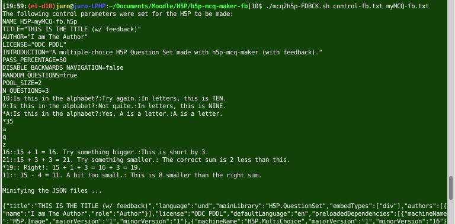
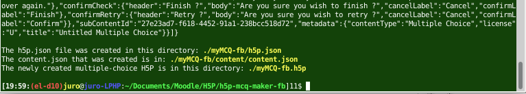

# h5p-mcq-maker-fb  

This repository contains a bash script for creating an [H5P](https://h5p.org) of multiple-choice questions (with a single correct answer; possibly with tips and right/wrong answer feedbacks) using the [H5P Question Set template](https://h5p.org/question-set) via the linux command line. Simply:  
```sh
./mcq2h5p-FDBCK.sh control-fb.txt myMCQ-fb.txt
```
where `myMCQ-fb.txt` (it may be named in some other way) is a plain-text input file that contains your multiple-choice questions and corresponding answers (possibly with tips and feedbacks) written in [H5P Question Set template markup](https://h5p.org/question-set) (see [tutorial](https://h5p.org/tutorial-question-set)), e.g.,  
```
1. Which of the following is a letter?
10:Is this in the alphabet?:Try again.:In letters, this is TEN.
9:Is this in the alphabet?:Not quite.:In letters, this is NINE.
*A:Is this in the alphabet?:Yes, A is a letter.:A is a letter.

2. Which of the following is a number?
*35
a
q
z

3. 15 + 1 + 3 = _____
16::15 + 1 = 16.  Try something bigger.:This is short by 3.
21::15 + 3 + 3 = 21.  Try something smaller.:  The correct sum is 2 less than this.
*19:: Right!: 15 + 1 + 3 = 16 + 3 = 19.
11:: 15 - 4 = 11.  A bit too small.: This is 8 smaller than the right sum.

```
(Note: Tips, correct- and wrong-answer feedbacks are given in item 1.  Item 2 has neither tips nor right/wrong answer feedbacks.  Item 3 has not tips but has right/wrong answer feedbacks.)  
The H5P is created in the main directory and is called `NAME_H5P_DIR.h5p` based on the value of `H5P_NAME` in your `control-fb.txt` file.  There are a number of ways to view/play this newly created H5P:  

* use [Lumi](https://app.lumi.education/), an offline H5P viewer and editor
* upload into a platform (e.g., [h5p.org's H5P test drive page](https://h5p.org/testdrive-h5p), Learning Management Systems (LMSs)); allows for further editing.
* view using [h5p-view](https://github.com/justineuro/h5p-view) (a bash script that implements [h5p-standalone](https://github.com/tunapanda/h5p-standalone) to allow viewing/playing the H5P via the linux command line).
* use [h5p-standalone](https://github.com/tunapanda/h5p-standalone) directly (as in [h5p-misc-math-001](https://justineuro.github.io/h5p-misc-math-001/) or [h5p-byBrowser](https://justineuro.github.io/h5p-byBrowser/)).

## Instructions on use
To use:

* Clone this repository: `git clone https://github.com/justineuro/h5p-mcq-maker-fb.git`.
* Prepare a plain text file, say `myMCQ-fb.txt` (it may be some other filename), containing your MC questions and answers written in [H5P Question Set template markup](https://h5p.org/question-set) (see the [H5P Question Set Tutorial](https://h5p.org/tutorial-question-set) for additional information), and save it under the `h5p-mcq-maker-fb` directory that you just cloned.
* Edit the `control-fb.txt` file to set the parameters for your new H5P (includes `NAME_H5P`, `TITLE`, `AUTHOR`, `LICENSE`, `INTRODUCTION`, `PASS_PERCENTAGE`, `DISABLE_BACKWARDS_NAVIGATION`, `RANDOM_QUESTIONS`, and `POOL_SIZE`; see `mcq2h5p-FDBCK.sh` for a description of these parameters).
* At a linux command line within your `h5p-mcq-maker-fb` directory, issue the command:
```sh
./mcq2h5p-FDBCK.sh control-fb.txt myMCQ-fb.txt
```
where `myMCQ-fb.txt` may be some other file containing your MC questions and answers (possibly with tips and/or right/wrong answer feedbacks).  **(Note: This file must end in two blank lines.)**  
The `h5p.json` and `content.json` files will be created in the appropriate locations inside the `NAME_H5P_DIR` (based on the value of `NAME_H5P` in the `contro-fb.txt`) directory; the `NAME_H5P_DIR` directory will be zipped-up to create your new H5P).  Your newly created [Question Set H5P](https://h5p.org/question-set), filename: `NAME_H5P_DIR.h5p,` will be found in the `h5p-mcq-maker` directory.  
  
[... section omitted ...]  


## Contents of this repositoty
This folder includes (among others):
  
* [`mcq2h5p-FDBCK.sh`](./mcq2h5p-FDBCK.sh) - a bash script that converts to a [Question Set H5P](https://h5p.org/question-set) a plain text file containing mutiple-choice questions and answers .
* [`h5p-mcq-616_libs`](./h5p-mcq-616_libs) - a folder that contains the libraries inside the [`question-set-616.h5p`](https://h5p.org/question-set) re-use template that's available from the [Examples & downloads section](https://h5p.org/content-types-and-applications) at [https://h5p.org](https://h5p.org); the `h5p.json` and `content/content.json` files will be over-written to produce your new H5P.  Among other libraries, this folder contains: __`H5P.QuestionSet-1.20`__, __`H5P.MultiChoice-1.16`__, and __`H5P.Question-1.5`__. In addition, this folder also contains the library from the `H5P.MathDisplay-1.0.7.h5p` (add support for math content rendering).
* [`control-fb.txt`](./control-fb.txt) -  a plain text file containing the control parameters for your new H5P (e.g., `NAME_H5P`, `TITLE`, `AUTHOR`, `LICENSE`, `INTRODUCTION`, `PASS_PERCENTAGE`, `DISABLE_BACKWARDS_NAVIGATION`, `RANDOM_QUESTIONS`, and `POOL_SIZE`; these are used for creating the `h5p.json` and `content.json` of your new H5P).  You would want to edit this to suit your own specifications.
* [`myMCQ-fb.txt`](./myMCQ-fb.txt) - an example of 3 multiple-choice questions, 2 of which are selected each time the H5P is viewed/played.  (Note that the `MathJax` symbol "`\`" has to be triply escaped.  Thus, `\(` should be written as `\\\\(` and `\sqrt{2}` should be written as `\\\\sqrt{2}`.)
* [`myMCQ-fb.h5p`](./myMCQ-fb.h5p) - the H5P created by `mcq2h5p-FDBCK.sh` based on questions in `myMCQ-fb.txt` and using the values of control parameters in `control-fb.txt`.

The repository also contains the files for two other examples.

* Files for [`myMCQ-fb-1.h5p`](./myMCQ-fb-1.h5p): `control-fb-1.txt` and `myMCQ-fb-1.txt` (5 questions); 3 randomly chosen questions are shown each time the H5P is played
* Files for [`myMCQ.h5p`](./myMCQ.h5p): `control.txt` and `myMCQ.txt` (10 questions w/o tips or feebbacks); 5 randomly chosen questions are shown each time the H5P is played


<a rel="license" href="http://creativecommons.org/licenses/by/4.0/"></a><br /><span xmlns:dct="http://purl.org/dc/terms/" property="dct:title">h5p-mcq-maker-fb</span> by <a xmlns:cc="http://creativecommons.org/ns#" href="https://github.com/justineuro/" property="cc:attributionName" rel="cc:attributionURL">Justine Leon A. Uro</a> is licensed under a <a rel="license" href="http://creativecommons.org/licenses/by/4.0/">Creative Commons Attribution 4.0 International License</a>.<br />Based on a work at <a xmlns:dct="http://purl.org/dc/terms/" href="https://github.com/justineuro/h5p-mcq-maker-fb" rel="dct:source">https://github.com/justineuro/h5p-mcq-maker-fb</a>.
